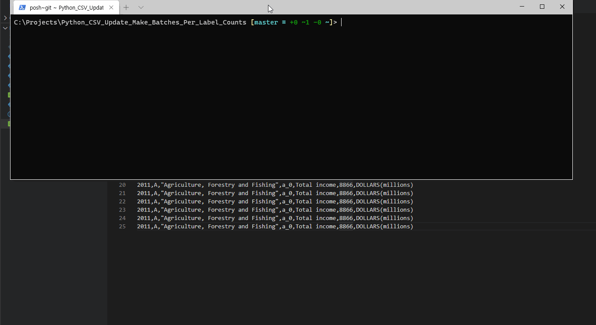

## Smaller Batch Maker based on Unique Labels Count Per CSV

* slicer moves to next file once unique label count goes beyond the limit per CSV
```
1. Counter: 
Counts how many unique labels (column name+value) and lines excluding header in CSV.
Can take both singular string or string with asterisk to find all files matching the pattern.

2. Updater:
Updates column values to match allowed special characters.
Remove special characters at the beginning and ending.
Update the column value if it exceeds duplicate allowance per unique label 

3. Slicer:
Slice the CSV into smaller files based on allowed unique labels count per CSV

4. Updater&Slicer:
Combination of 2 and 3

Example CSV from
https://www.stats.govt.nz/large-datasets/csv-files-for-download/
```